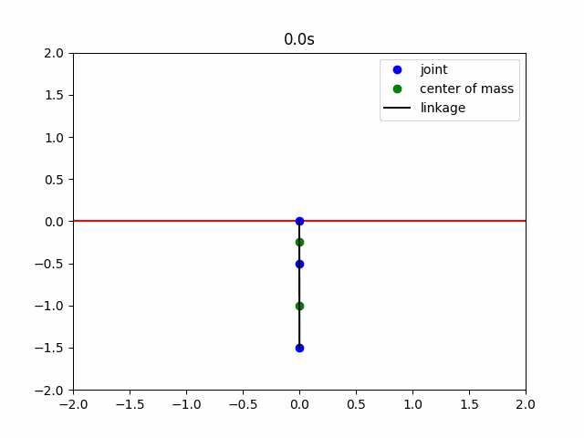
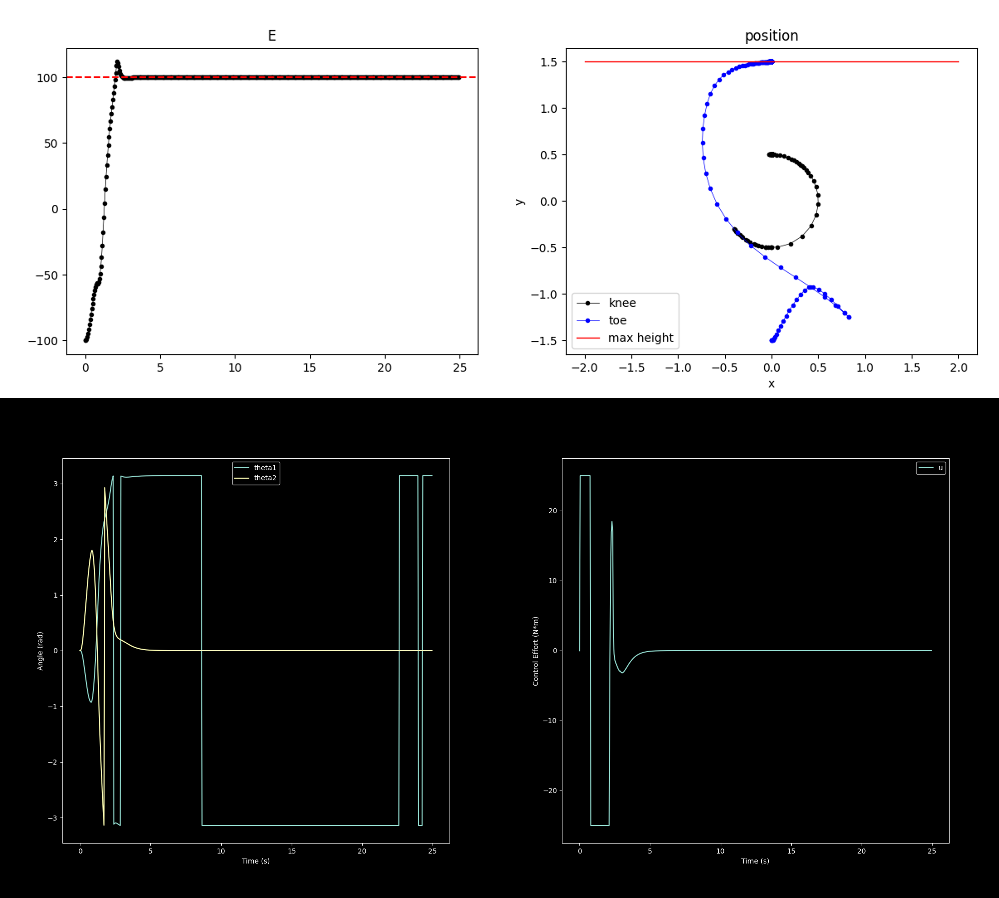

# ESE 650: Learning in Robotics - Homework 3

This project implements a controller to swing up and balance an Acrobot, a two-link under-actuated system. The Acrobot has a torque input at the waist joint and can move in the vertical plane. The goal is to take the Acrobot from the initial hanging position to the upright position and keep it there.

## Requirements

- Python 3.8 or higher
- Numpy
- Matplotlib
- Scipy

## Usage

- To run the controller, execute `python LQRforAcrobat.py.` This will simulate the Acrobot dynamics and apply the controller input at each time step. The controller consists of two parts: an energy-shaping controller that swings up the Acrobot from the bottom to the top and an LQR controller that stabilizes the Acrobot at the upright position.
- You change the parameters of the Acrobot, such as the masses, lengths, inertias of the links, and the controller parameters in the same file.

## Results

The controller successfully swings up and balances the Acrobot in about 10 seconds. The energy shaping controller adds or subtracts energy to the system by applying torque in the direction of motion. The LQR controller linearizes the dynamics around the upright position and uses feedback to keep the Acrobot there. The following figure shows an example of the joint angles and controls input over time:

More details for the controller can be found [here.](./01_Report/ESE6500_Homework3.pdf)
