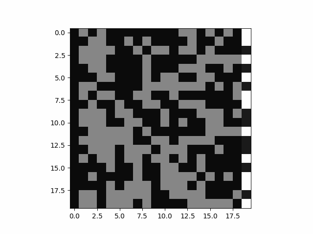
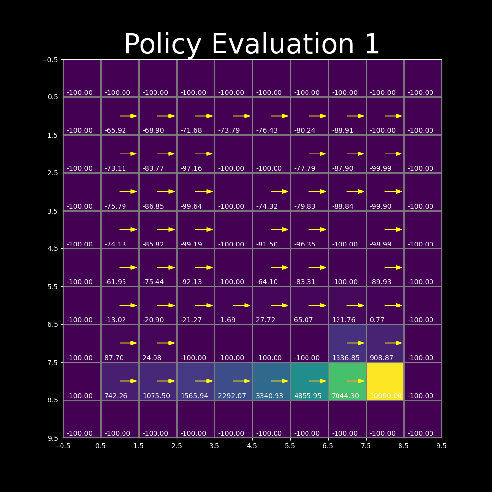
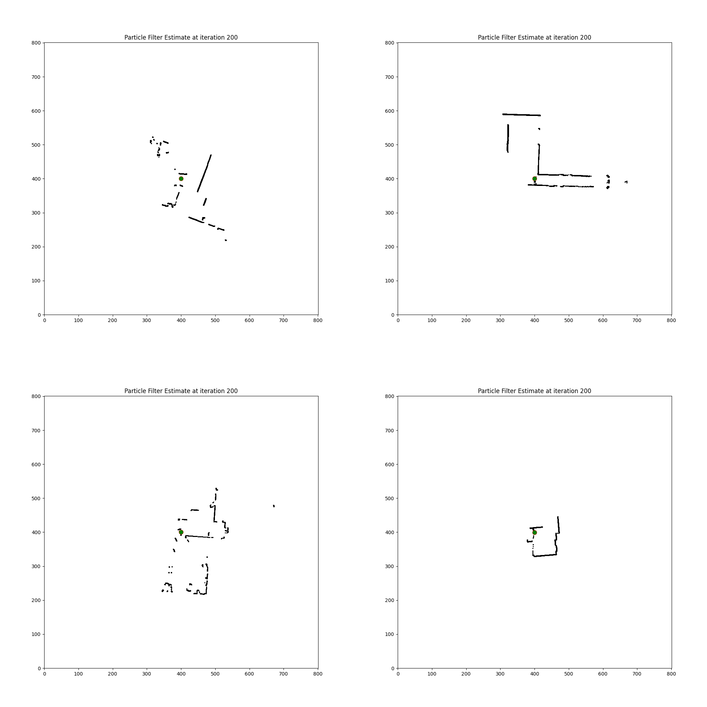

# Learning in Robotics Projects

This repository has projects implemented as a part of the course work of [ESE 6500](https://docs.google.com/document/d/1ArZStjlDnhbReU3OmyiSvKDCadUopp-btZaPwpEXwFw/edit): Learning in Robotics taught by [Dr. Prateek Chaudary](https://pratikac.github.io/). The course covers the fundamentals of three aspects of robotics: perception, planning and learning. Topics include state estimation (EKF, UKF, Particle filters, visual-inertial odometry), control and planning (LQR, MDPs, sampling-based planning), reinforcement learning (policy gradients, Q-learning, imitation learning, offline, multi-task and meta-RL). The coursework had both applied and theoretical aspects. The excellent notes for this course can be accessed [here](https://pratikac.github.io/pub/23_ese650.pdf).

You can see the following projects in this repo:

## Histogram Filter

## Policy Iteration

## Simultaneous Localization and Mapping

## Linear Quadratic Regulator

